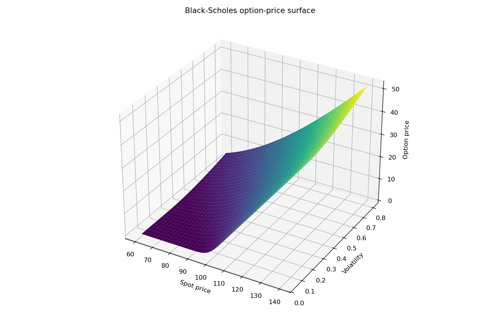
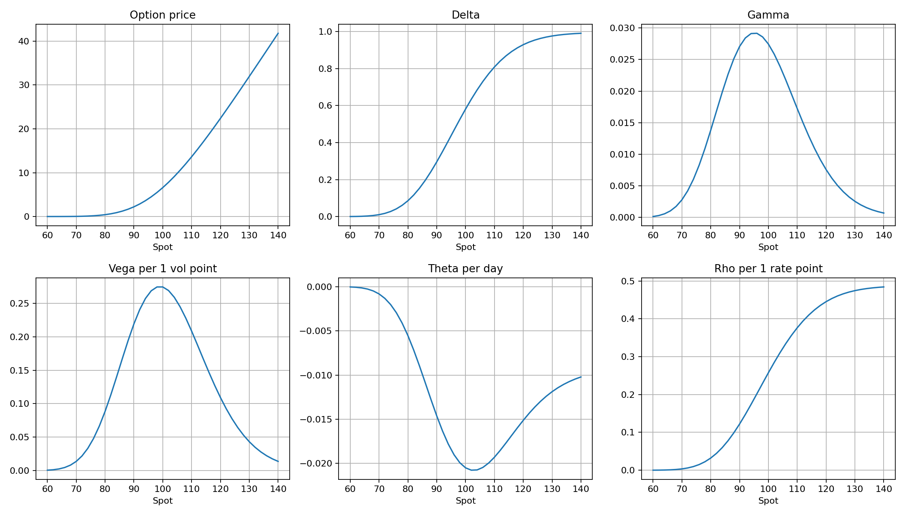

# Options Pricing & Risk Analytics Calculator

A modular Python project for pricing options, checking no-arbitrage relationships, calculating Greeks, recovering implied volatility and comparing **Black–Scholes–Merton, Cox–Ross–Rubinstein binomial trees and Monte Carlo simulation**.

**Python · NumPy · pandas · SciPy · Streamlit · Monte Carlo · derivatives pricing · automated tests**



## Project objective

The project connects option-pricing theory to a practical analytics workflow. Rather than returning a single price, it asks whether different pricing approaches agree, how the option responds to market inputs and whether the calculations satisfy basic financial consistency checks.

It supports:

- European call and put pricing;
- American binomial-tree pricing;
- Black–Scholes Greeks;
- implied-volatility recovery;
- put–call parity and no-arbitrage bounds;
- Monte Carlo pricing with uncertainty estimates;
- price/Greek sensitivity analysis;
- an interactive Streamlit calculator.

## Baseline example

The saved research workflow uses the following option inputs:

| Input | Value |
|---|---:|
| Spot | 100 |
| Strike | 100 |
| Time to expiry | 0.5 years |
| Risk-free rate | 5% |
| Volatility | 20% |
| Dividend yield | 1% |
| Option type | Call |
| Binomial steps | 600 |
| Monte Carlo simulations | 250,000 |
| Monte Carlo seed | 42 |

## Model comparison

For that saved example, the three European call-pricing approaches converge closely:

| Method | Price |
|---|---:|
| Black–Scholes–Merton | **6.594025** |
| CRR Binomial — European | **6.591689** |
| Monte Carlo | **6.606874** |

The Monte Carlo run reports a standard error of **0.008305** and a saved confidence interval of approximately **[6.590596, 6.623152]**, which contains the Black–Scholes analytical value.

This agreement is a useful implementation check: three different numerical/analytical approaches produce very similar values under the same European-option assumptions.

## Pricing and risk checks

The stored calculation summary also reports:

- Black–Scholes call price: **6.594025**;
- Black–Scholes put price: **4.623769**;
- put–call parity residual: approximately **-7.1 × 10⁻¹⁵**;
- recovered implied volatility: **20.0%**, matching the input volatility;
- American put value from the binomial calculation: **4.811397**;
- comparable European put value: **4.621433**;
- saved early-exercise premium: **0.189964**.

These checks make the project easier to audit than a calculator that only prints a final number.

## Greeks

For the baseline call, the stored Black–Scholes sensitivities include:

| Greek | Saved value |
|---|---:|
| Delta | 0.581085 |
| Gamma | 0.027444 |
| Vega per 1 vol point | 0.274443 |
| Theta per day | -0.020503 |
| Rho per 1 rate point | 0.257573 |

The workflow also produces Greek profiles across a range of spot prices.



## Models implemented

### Black–Scholes–Merton

`black_scholes.py` contains the analytical European option-pricing implementation, input validation, Greeks, option bounds and put–call parity checks.

### Cox–Ross–Rubinstein binomial tree

`binomial.py` implements tree-based valuation and supports both European and American exercise logic. The American put comparison demonstrates the additional value that can arise from early exercise.

### Monte Carlo simulation

`monte_carlo.py` estimates the discounted expected payoff by simulation and reports sampling uncertainty so the numerical estimate can be compared with the analytical benchmark.

### Implied volatility

`implied_volatility.py` numerically recovers the volatility that reproduces a supplied market price. In the saved self-consistency check, feeding the model price back into the solver recovers the original **20%** volatility.

## Interactive application

`app.py` provides a Streamlit interface so the model inputs can be changed without editing Python code.

Run it with:

```bash
cd options-pricing-project
streamlit run app.py
```

## Project structure

```text
Options-Pricing-Project/
├── README.md
└── options-pricing-project/
    ├── app.py
    ├── main.py
    ├── main.ipynb
    ├── complete_options_pricing_theory_guide.ipynb
    ├── black_scholes.py
    ├── binomial.py
    ├── monte_carlo.py
    ├── implied_volatility.py
    ├── analytics.py
    ├── market_data.py
    ├── requirements.txt
    ├── tests/
    └── outputs/
        ├── calculation_summary.json
        ├── model_price_comparison.csv
        ├── option_price_surface.csv
        ├── greek_profile.csv
        └── saved charts
```

## Start here

For a portfolio review:

1. **`README.md`** — project summary and verified outputs.
2. **`options-pricing-project/main.ipynb`** — end-to-end calculations and visual analysis.
3. **`options-pricing-project/complete_options_pricing_theory_guide.ipynb`** — theory behind pricing, Greeks and implied volatility.
4. **`options-pricing-project/app.py`** — interactive calculator.
5. **`options-pricing-project/tests/`** — validation of Black–Scholes, binomial, Monte Carlo, implied volatility and input checks.

## How to run

```bash
cd options-pricing-project
pip install -r requirements.txt
python main.py
```

The script writes calculation summaries, model comparisons, sensitivity tables and charts to `outputs/`.

To launch the interactive version:

```bash
streamlit run app.py
```

## Testing

The repository includes pytest coverage for:

- Black–Scholes calculations;
- binomial-tree pricing;
- Monte Carlo behaviour;
- implied-volatility recovery;
- input validation.

Run:

```bash
pytest
```

## Limitations

- Black–Scholes relies on its standard modelling assumptions and is not a complete description of real option markets.
- Monte Carlo accuracy depends on simulation count and modelling assumptions.
- The baseline examples use simplified inputs and do not include every real-world feature of listed-option pricing.
- Market-data integration is optional; the saved calculations in this repository are model demonstrations rather than trading recommendations.

## Skills demonstrated

**Derivatives pricing · Black–Scholes · CRR binomial trees · Monte Carlo simulation · variance-aware numerical analysis · Greeks · implied volatility · no-arbitrage validation · American early exercise · modular Python design · Streamlit · automated testing**

> Educational and quantitative-research project only — not investment advice.
